# Back-End Challenge: LiterAlura - Alura & Oracle

## Sobre

Este desafio foi proposto como finalização da trilha **"Java e Spring Framework G7 - ONE (Oracle Next Education)"** destinada aos alunos da especialização em back-end do programa ONE, desenvolvido pela **Alura** em parceria com a **Oracle**.  
O projeto visa aplicar todos os conteúdos aprendidos durantes os cursos da trilha em questão e das anteriores, fazendo o uso principalmente do Spring Framework, consumo de uma API, JPA e banco de dados (PostgreSQL). 
O desafio era desenvolver uma aplicação de biblioteca que consome a Guntendex API, a fim de coletar dados de livros e autores e armazena-los em um banco de dados. 

## Funcionalidades

### Uso da Aplicação

- Após a configuração do ambiente e a inicialização da aplicação, selecione uma das opções no menu apresentado.

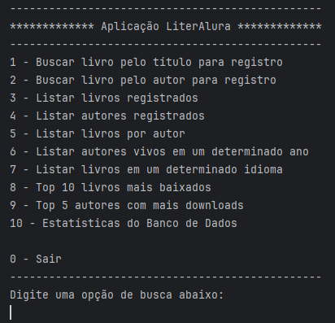

#### Exemplos

- Opção 1 selecionada, fazendo a busca por títulos de livros na Gutendex API:

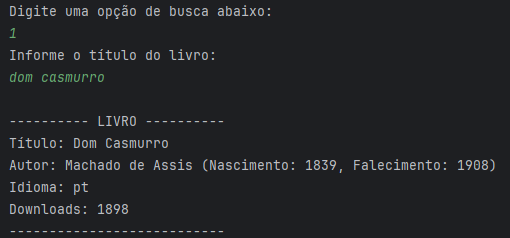

- Opção 2 selecionada, fazendo a busca por autores, e depois escolhendo um livro para registro:

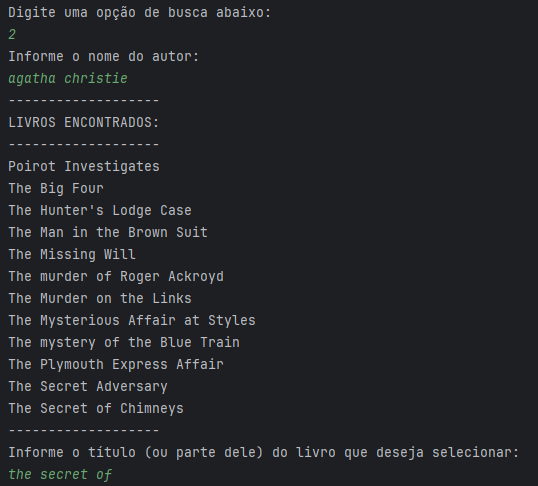
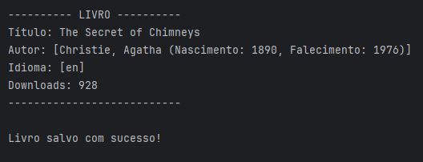

- Opção 3 selecionada, lista todos os livros armazenados no banco de dados local:

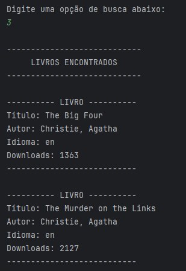

- Opção 4 selecionada, lista todos os autores armazenados no banco de dados local:

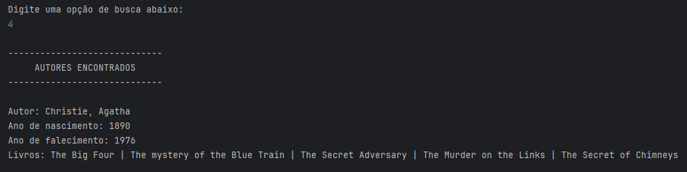

- Opção 5 selecionada, a partir da busca pelo nome de um autor, a aplicação listará todos os livros deste autor que estão armazenados no banco de dados:

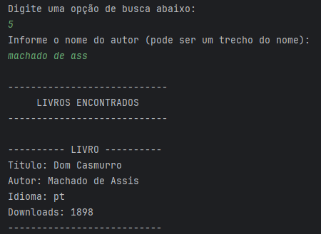

- Opção 6 selecionada, a partir da seleção de um ano, a aplicação fará uma busca no banco de dados e listará autores que estavam vivos no ano informado:

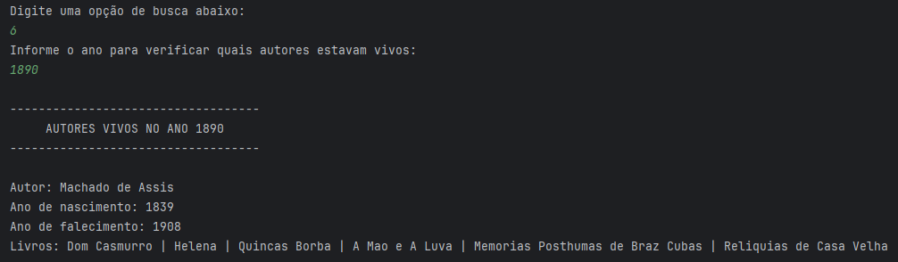

- Opção 7 selecionada, a partir da escolha de um idioma, a aplicação fará uma busca no banco de dados e listará livros com o idioma selecionado:

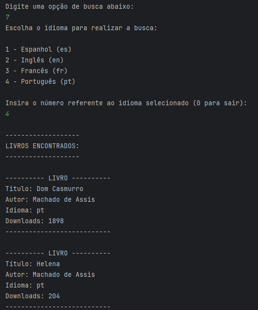

- Opção 8 selecionada, a aplicação listará os dez (10) livros com maior núro de downloads:

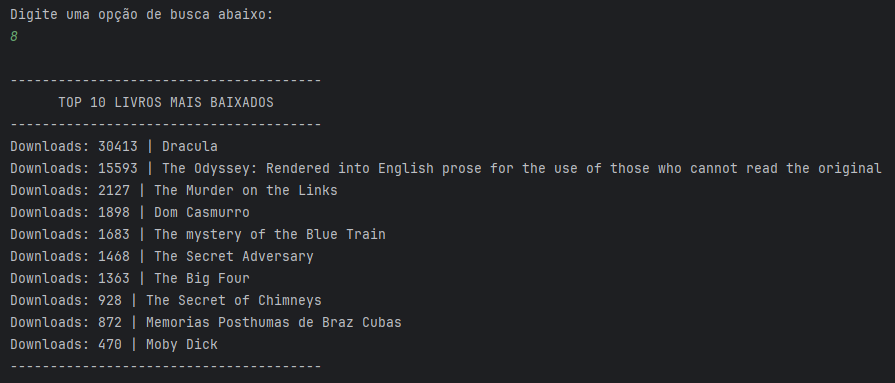

- Opção 9 selecionada, a aplicação listará os cinco (5) autores que possuem maior número de downloads de seus livros:

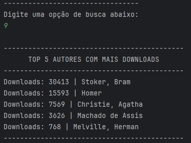

- Opção 10 selecionada, a aplicação retornará algumas estatísticas referentes ao banco de dados:

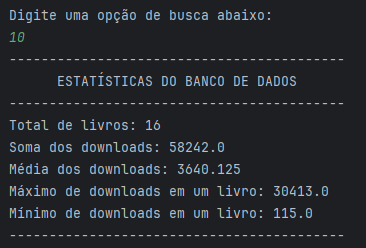

- Em caso de erros com nome de livros, nome de autores, seleção em menus, a aplicação retornará ao menu principal.

## Tecnologias Utilizadas

- Java JDK: versão 21.
- Java Spring Framework.
- Gutendex API: Uma API utilizada para obter dados dos livros e autores.
- Postman: Utilizado para testes da API.
- Java Persistence API (JPA).
- PostgreSQL (Banco de Dados).
- IDE (preferencia pessoal): Foi utilizado o IntelliJ IDEA.

## Como executar o projeto

1. **Configurar o Ambiente:** Certifique-se de ter as configurações das variáveis de ambiente correspondentes como do projeto (*).
2. **Banco de Dados:** Certifique-se de possuir um banco de dados com o nome "literalura_db". (*)
3. **Obter o Projeto:** Faça o clone do projeto em sua máquina local.
4. **Executar o Código:** Execute a aplicação da classe "ChallengeLiteraluraApplication.java" em sua IDE favorita.
6. **Buscar por Livros e Autores:** Siga as instruções no terminal para buscar livros ou autores, a fim de registra-los em seu banco de dados.
7. **Finalizar a Aplicação:** Após todos os registros feitos e as interações com o banco de dados forem concluídas, selecionar para sair da aplicação e ela encerrará.

(*) - Dados que podem ser alterados de acordo com o usuário, desde que sejam feitas as devidas alterações no projeto (application.properties).

## Badge de Conclusão

